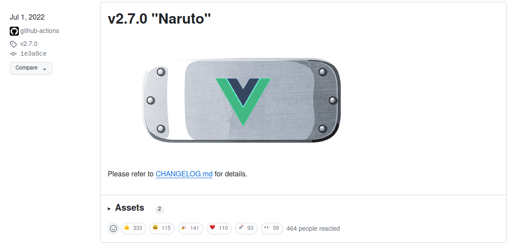
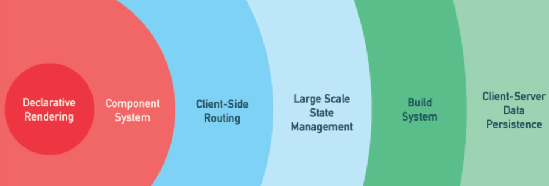
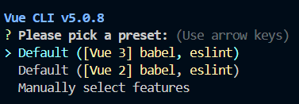
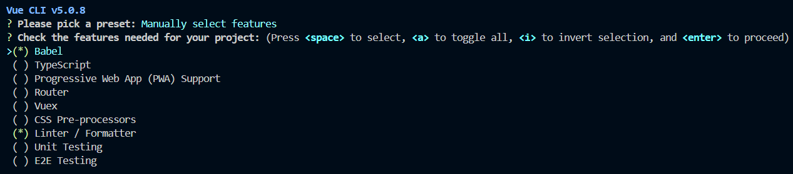
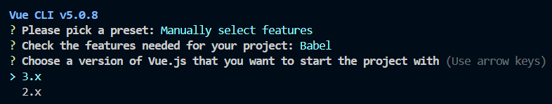
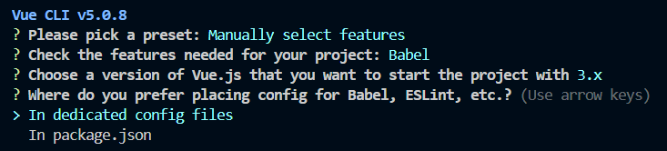
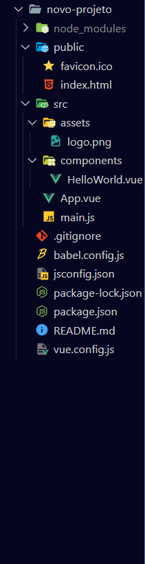

# `Vue.js`: onde o progresso e a flexibilidade se encontram

Esta é uma *overview* de diferentes conceitos pertinentes ao framework `Vue.js`

# Seção 1: Introdução ao Vue.js

## 1.1 O que é Vue.js?

- `Vue` [viu] é um framework progressivo de JavaScript usado para a criação de interfaces de usuário. Em termos arquiteturais, sobretudo em uma base MVC, o `Vue.js` atende às características da camada de visualização, a View. Isto é, ele disponibiliza elementos que facilitam e diversificam o processo de criação de interfaces e de apresentação de conteúdo. Dessa forma, suas características fundamentais são: renderização declarativa, através da extensão do padrão HTML, e reatividade, o qual performa por meio de um processo de observação e atualização.   

### 1.1.1 História

- `Vue.js` foi criado por Evan You após trabalhar para o Google usando o AngularJS em vários projetos. Mais tarde, ele resumiu seu processo de pensamento: "Eu pensei, e se eu pudesse apenas extrair a parte que eu realmente gostei sobre o Angular e construir algo realmente leve." O framework foi anunciado publicamente pela primeira vez em fevereiro de 2014.
- Os nomes das versões são frequentemente derivados de mangás e animes:


### 1.1.2 Framework progressivo
- Um **framework progressivo** é uma abordagem para o desenvolvimento de frameworks que visa flexibilidade e adaptação gradual. Esses, a exemplo do `Vue.js` permitem que os desenvolvedores usem apenas as partes do framework que precisam e estendam ou personalizem conforme necessário. Essa abordagem contrasta com os frameworks monolíticos, que frequentemente fornecem uma grande base de código e muitos recursos, muitos dos quais podem não ser necessários.
  - Vantagens: flexibilidade, leveza, extensibilidade e iniciação rápida.
  - Desvantagens:

  
  - O código presente na pasta **framework_progressivo** na branch *develop-pedro-correia* mostra uma aplicação bem simples de como o `Vue` pode ser adicionado a uma aplicação já existente.

### 1.1.3 Programação reativa
- Programação reativa é um paradigma de programação declarativa baseado na ideia de processamento de eventos assíncronos e fluxos de dados. Nesse contexto, o `Vue.js` se introduz como um framework de abordagem binária - usando um observador e um gatilho - para implementar um **efeito reativo** em sua estrutura. Seu sistema de reatividade funciona em tempo de execução, ou seja, o processo ocorre enquanto o código é executado no navegador.
  - Vantagens: funciona sem precisar de uma build e há menos casos atípicos.
  - Desvantagens: é limitado à sintaxe do JavaScript.

- **Problema da reatividade:**
```javascript
let A0 = 1
let A1 = 2
let A2 = A0 + A1

console.log(A2) // 3

A0 = 2
console.log(A2) // continua sendo 3
```

- **A teoria da solução:**
```javascript
let A2

function update() {
  A2 = A0 + A1
}
```
- É necessário ter uma função poderosa que possa invocar o update() (o efeito) sempre que A0 ou A1 (as dependências) mudarem:
```javascript
whenDepsChange(update)
```
- Não é possível rastrear a leitura e a escrita de variáveis locais como no exemplo. Simplesmente não há um mecanismo para fazer isso em JavaScript puro. O que se pode fazer, no entanto, é interceptar a leitura e escrita de propriedades de objetos.

- Existem duas maneiras de interceptar o acesso a propriedades no JavaScript: `getters/setters` e `Proxies`. O `Vue 2` utilizava exclusivamente `getters/setters` devido às limitações de suporte do navegador. No `Vue 3`, `Proxies` são usados para objetos reativos e `getters/setters` são usados para `refs`. Aqui está um pseudo-código que ilustra como eles funcionam:
```javascript
function reactive(obj) {
  return new Proxy(obj, {
    get(target, key) {
      track(target, key)
      return target[key]
    },
    set(target, key, value) {
      target[key] = value
      trigger(target, key)
    }
  })
}

function ref(value) {
  const refObject = {
    get value() {
      track(refObject, 'value')
      return value
    },
    set value(newValue) {
      value = newValue
      trigger(refObject, 'value')
    }
  }
  return refObject
}
```

## 1.2 Por que Vue.js?

Aqui vocês podem destacar como `Vue.js` ganhou popularidade por sua facilidade de integração, reatividade, e a eficiente maneira de desenvolver componentes reutilizáveis.

### 1.2.1 Comparação

- Curva de Aprendizado:
    - React: Apresenta uma curva de aprendizado moderada, contudo, conta com uma comunidade robusta e uma ampla gama de recursos de aprendizado.
    - Angular: Mais complexo em comparação aos outros, requerendo um investimento de tempo para dominar todas as suas funcionalidades.
    - Vue: Mais acessível para iniciantes, oferece uma curva de aprendizado suave e documentação clara.

- Ecossistema e Suporte:

    - React: Possui uma comunidade vasta, uma grande quantidade de recursos disponíveis e é amplamente adotado.
    - Angular: Desfruta de suporte oficial do Google, mas pode ser mais desafiador encontrar soluções para questões menos comuns.
    - Vue: Sua comunidade está em crescimento, oferecendo uma ampla variedade de recursos e suporte.

- Performance e Tamanho do Pacote:

   - React: Apresenta bom desempenho, mas pode necessitar de mais bibliotecas externas para funcionalidades avançadas.
   - Angular: É robusto, porém pode resultar em aplicativos maiores, o que pode impactar na performance.
   - Vue: É leve e rápido, mesmo para pequenos projetos, e permite a adição de funcionalidades conforme necessário.

### 1.2.2 Popularidade

- A seguir estarão algumas imagens mostrando o quão popular `Vue` se situa no momento:
- **Ranking dos frameworks mais usados em 2023 segundo o StackOverflow:**


- **Casos de Uso:** Identifiquem e discutam alguns casos de uso ideais para `Vue.js`, como `SPAs` (Single Page Applications), aplicativos móveis com `Vue Native`, e por que empresas escolhem `Vue` para seus projetos.

## 1.3 Primeiros Passos com Vue.js

### 1.3.1 Usando `Vue.js` pela primeira vez

- Criar um projeto `Vue` é muito simples. Primeiro, você precisa identificar o tipo de projeto que vai trabalhar: legado ou novo. Caso seja o primeiro, o processo ocorrerá através de uma *CDN (Rede de Fornecimento de Conteúdo)*. Por essa maneira, não é preciso realizar nenhum build, você somente precisa informar o link do serviço através de uma tag script no arquivo HTML:
  - `<script src="https://unpkg.com/vue@3/dist/vue.global.js"></script>`
- Esse método é útil para aplicações legado ou para integração com algum framework de backend. Contudo, não será possível utilizar a sintaxe de *Componentes de Arquivo Único (SFC)*. Caso o intuito seja iniciar um projeto novo, utilize o `Vue CLI`, um sistema de linha de comando para o desenvolvimento rápido de projetos em Vue.js. A seguinte, estarão explicitados os passo a passos necessários:


- **Instalação:** Primeiro, é preciso instalar a ferramenta por meio de algum gerenciador de pacotes. Nesse contexto, pode ser tanto o **npm** quanto o **yarn**. 
  ```bash
  npm install -g @vue/cli
  # ou
  yarn global add @vue/cli
  ```
  - Depois da instalação, você terá acesso ao binário vue em seu terminal. Você pode verificar se ele foi propriamente instalado utilizando o comando vue, o qual lhe apresentará uma mensagem de ajuda listando os comandos disponíveis. Para checar a versão que está sendo utilizada em seu computador, é só utilizar o seguinte comando:
  ```bash
  vue --version
  ```

- **Criação de um Novo Projeto:** Agora, você só precisa escrever o seguinte comando no terminal para criar um projeto do zero:
  ```bash
  vue create <nome-do-projeto> 
  # o nome do seu projeto deve ficar dentro das tags
  ```
  - A seguir estão os passos-a-passos de como criar um projeto em `Vue`:

  - Caso escolha uma opção *default*, o processo já vai automaticamente:

    
  - Caso decida escolher manualmente:
  

  
  

  - Pronto! O seu projeto em `Vue` foi criado com sucesso!

  - É possível também intalar o `Vue.js` e criar um projeto ao mesmo tempo usando o seguinte comando:
  ```bash
  npm create vue@latest
  ```
- **Estrutura do Projeto:** um projeto `Vue` é composto por diferentes pastas e arquivos, a seguir estão alguns deles:



  - **node_modules:** Esta pasta contém as dependências do projeto, instaladas via npm ou Yarn.

  - **public:** Aqui estão os arquivos estáticos do projeto, como HTML, imagens e outros recursos que não precisam ser processados pelo webpack.

  - **src:** Esta é a pasta principal onde o código-fonte do aplicativo Vue está localizado.

     - **assets:** Contém arquivos de mídia como imagens, ícones, etc.

     - **components:** Aqui estão os componentes Vue reutilizáveis que compõem o aplicativo.

     - **App.vue:** Este arquivo é o componente raiz do aplicativo Vue. Ele contém a estrutura básica do aplicativo e é responsável por renderizar os outros componentes.

     - **main.js:** Este é o arquivo de entrada principal do aplicativo Vue. Ele inicializa a instância Vue e monta o aplicativo na página HTML.

  - **babel.config.js:** Este arquivo contém a configuração do Babel para o projeto Vue. Ele define como o Babel deve transpilar o código JavaScript.
  - **jsonconfig.js:** Configura a integração do Visual Studio Code com projetos JavaScript.
  - **package-lock.json:** Registra as versões exatas das dependências instaladas pelo npm, garantindo consistência entre ambientes
  - **package.json:** Este arquivo contém metadados do projeto e as dependências do npm. Ele também inclui scripts para executar tarefas comuns, como iniciar o servidor de desenvolvimento, compilar o código, etc.
  - **vue.config.js:** Configura o ambiente de compilação do Vue CLI, permitindo personalização das opções de compilação, webpack e ambiente de desenvolvimento.

- **Atualização da versão:** Para atualizar o pacote global do Vue CLI, utilize o comando:
  ```bash
  npm update -g @vue/cli
  # OR
  yarn global upgrade --latest @vue/cli
  ```

## 1.4 Primeiro Componente Vue

- Componentes nos permitem dividir a interface do usuário em partes independentes e reutilizáveis e pensar em cada parte isoladamente. É muito semelhante a como aninhamos elementos HTML nativos, mas o `Vue.js` implementa seu próprio modelo de componente que nos permite encapsular conteúdo e lógica personalizados em cada componente. Geralmente, os componentes são estruturados em uma forma de árvore:

- Ao criar um projeto Vue com uma build, é possível utilizar a sintaxe de **Componentes de Arquivo-Único (SFC)**, com extensão *.vue*.
- A seguir há um exemplo de componentes pai e filho se comunicando através da opção *props*:
- **Classe-Pai**:
```vue
<template>
  <MeuComponente :nome="nome"></MeuComponente>
</template>

<script>
import MeuComponente from './components/MeuComponente'

export default {
  name: 'App',
  components: {
    MeuComponente
  },
  data() {
    return {
      nome: "Pedro"
    }
  }
}
</script>

<style></style>
```

- **Classe-Filho**:
```vue
<template>
    <h1>Olá, eu sou o seu primeiro componente!</h1>
    <p>Prazer em lhe conhecer, {{ nome }}</p>
</template>

<script>
export default {
    props: ['nome']
}
</script>

<style></style>
```
# Seção 2: Arquitetura do Vue.js

- Nesta seção explorem a arquitetura fundamental do `Vue.js`.
- Abordem sua estrutura de componentes, o sistema reativo e o que isso significa e a comunicação entre componentes.
- O objetivo é fornecer aos colegas um entendimento detalhado dos aspectos arquiteturais do `Vue.js`, permitindo uma apreciação mais profunda de como aplicativos são construídos e gerenciados.

## 2.1 Estrutura de Componentes do Vue.js

- A estrutura básica de um componente *.vue* é a seguinte:
 ```vue
   <template>
     <div>{{ message }}</div>
   </template>

   <script>
   export default {
     data() {
       return {
         message: 'Olá Vue!'
       }
     }
   }
   </script>

   <style>
   div {
    color: #fff;
    background-color: #000;
   }
   </style>
```

- Cada instância de componente `Vue` passa por uma série de etapas de inicialização quando é criada - por exemplo, ela precisa configurar a observação de dados, compilar o modelo, montar a instância no DOM e atualizar o DOM quando os dados mudam. No processo, também executa funções chamadas de **ganchos (hooks)** do ciclo de vida, dando aos usuários a oportunidade de adicionar seu próprio código em estágios específicos.


## 2.2 Sistema Reativo do Vue.js
### 2.2.1 Entendendo a reatividade
- Nessa seção, abordaremos como a reatividade funciona em uma aplicação `Vue` seguindo as duas APIs disponíveis. 

#### 2.2.1.1 Composition API
- Nessa API, a maneira recomendada de declarar estado reativo é usando a função ref():

```javascript
import { ref } from 'vue'
const count = ref(0)
```

- ref() recebe o argumento e o retorna envolvido em um objeto ref com uma propriedade *.value*:

```javascript
const count = ref(0)

console.log(count) // { value: 0 }
console.log(count.value) // 0

count.value++
console.log(count.value) // 1
```

- Quando você usa um *ref* em um modelo e altera o valor do *ref* depois, o `Vue` detecta automaticamente a mudança e atualiza o DOM de acordo. Isso é possível com um sistema de reatividade baseado no rastreamento de dependências. Quando um componente é renderizado pela primeira vez, o `Vue` rastreia todos os *refs* que foram usados durante a renderização. Mais tarde, quando um *ref* é alterado, ele aciona uma nova renderização para os componentes que o estão rastreando. No JavaScript padrão, não há maneira de detectar o acesso ou a alteração de variáveis simples. No entanto, podemos interceptar as operações de obtenção e configuração das propriedades de um objeto usando métodos **getter** e **setter**. A propriedade *.value* dá ao `Vue` a oportunidade de detectar quando um *ref* foi acessado ou alterado. Por baixo dos panos, o `Vue` realiza o rastreamento em seu **getter** e realiza o acionamento em seu **setter**. 
- **FALAR SOBRE O REACTIVE TAMBÉM**

#### 2.2.1.2 Options API
- Nessa API, utiliza-se a opção *data* para declarar o estado reativo de um componente. O valor da opção deve ser uma função que retorna um objeto. O `Vue` chamará a função ao criar uma nova instância do componente e envolverá o objeto retornado em seu sistema de reatividade. Todas as propriedades deste objeto são chamadas na instância do componente (`this` em métodos e ganchos de ciclo de vida):

```javascript
export default {
  data() {
    return {
      count: 1
    }
  },

  mounted() {
    console.log(this.count) // 1
    this.count = 2
  }
}
```

- Em `Vue 3`, os dados são tornados reativos através do uso de Proxies do JavaScript.

### 2.2.1.3 Atualização no DOM
- Quando você altera o estado reativo, o DOM é atualizado automaticamente. No entanto, deve-se notar que as atualizações do DOM não são aplicadas de forma síncrona. Em vez disso, o `Vue` as armazena em buffer até o "próximo tick" no ciclo de atualização para garantir que cada componente seja atualizado apenas uma vez, independentemente de quantas alterações de estado você tenha feito.Para aguardar a conclusão da atualização do DOM após uma alteração de estado, você pode usar a API global nextTick():
```javascript
import { nextTick } from 'vue'

export default {
  methods: {
    async increment() {
      this.count++
      await nextTick()
      // Now the DOM is updated
    }
  }
}
```

### 2.2.2 Observadores e propriedades computadas
- No `Vue.js`, as "propriedades computadas" são propriedades cujos valores são derivados de outras propriedades de dados. Elas são como funções que são armazenadas em cache com base em suas dependências. As propriedades computadas são definidas nas opções do componente `Vue` e retornam um valor com base nas propriedades de dados da instância `Vue`.
- A principal vantagem de usar propriedades computadas é que elas oferecem uma maneira de realizar manipulação de dados ou cálculos enquanto mantêm o modelo simples e legível. As propriedades computadas são reativas, o que significa que são atualizadas automaticamente sempre que suas dependências mudam.
- Em vez de uma propriedade computada, podemos definir a mesma função como um *método*. Para o resultado final, as duas abordagens são de fato exatamente iguais. No entanto, a diferença é que as propriedades computadas são armazenadas em cache com base em suas dependências reativas. Uma propriedade computada só será reavaliada quando algumas de suas dependências reativas tiverem mudado. Em comparação, a chamada de métodos sempre rodará a função quando for preciso re-renderizar elementos

```javascript
export default {
  data() {
    return {
      count: 1
    }
  },
  computed: {
    contagemVezesDez() {
      return this.count * 10
    }
  }
}
```

- Isso também significa que a seguinte propriedade computada nunca será atualizada, porque `Date.now()` não é uma dependência reativa:

```javascript
computed: {
  now() {
    return Date.now()
  }
}
```

### 2.2.3 Virtual DOM

- O **DOM virtual (VDOM)** é um conceito de programação onde uma representação ideal, ou "virtual", de uma interface do usuário é mantida na memória e sincronizada com o "real" DOM. O conceito foi pioneirado pelo React e foi adotado em muitos outros frameworks com diferentes implementações, incluindo o `Vue`.
- O **DOM virtual** é mais um padrão do que uma tecnologia específica, então não há uma implementação canônica única. Podemos ilustrar a ideia usando um exemplo simples:

```javascript
const vnode = {
  type: 'div',
  props: {
	id: 'olá'
  },
  children: [
	/* outros vnodes */
  ]
}
```

- Aqui, vnode é um objeto JavaScript simples (um "nó virtual") representando um elemento `<div>`. Ele contém todas as informações que precisamos para criar o elemento real. Ele também contém mais nós filhos virtuais, o que o torna a raiz de uma árvore **DOM virtual**.
- Um renderizador em tempo de execução pode percorrer uma árvore **DOM virtual** e construir a partir dela uma árvore **DOM real**. Esse processo é chamado de **montagem**.
- Se tivermos duas cópias de árvores **DOM virtuais**, o renderizador também pode percorrer e comparar as duas árvores, descobrindo as diferenças e aplicando essas alterações ao **DOM real**. Esse processo é chamado de **patch**.
- O principal benefício do **DOM virtual** é que ele dá ao desenvolvedor a capacidade de criar, inspecionar e compor estruturas de UI desejadas de forma declarativa, deixando a manipulação direta do DOM para o renderizador.

- A implementação do **DOM virtual** no `React` e na maioria das outras implementações de **DOM virtual** são puramente em tempo de execução: o algoritmo de reconciliação não pode fazer suposições sobre a árvore **DOM virtual** de entrada, então ele tem que percorrer totalmente a árvore e diferenciar as propriedades de cada nó virtual para garantir a correção. Além disso, mesmo que uma parte da árvore nunca mude, novos nós virtuais são sempre criados para eles em cada re-renderização, resultando em pressão de memória desnecessária. Este é um dos aspectos mais criticados do **DOM virtual**: o processo de reconciliação um tanto bruto sacrifica eficiência em troca de declaratividade e correção.
- Contudo, no `Vue`, o framework controla tanto o compilador quanto o tempo de execução. Isso nos permite implementar muitas otimizações em tempo de compilação que apenas um renderizador fortemente acoplado pode aproveitar. O compilador pode analisar estaticamente o modelo e deixar dicas no código gerado para que o tempo de execução possa fazer atalhos sempre que possível. Ao mesmo tempo, ainda preservamos a capacidade do usuário de voltar para a camada da função de renderização para um controle mais direto em casos extremos. O nome desse conceito híbrido é **DOM Virtual Informado pelo Compilador (Compiler-Informed Virtual DOM)**.


## 2.3 Comunicação Entre Componentes
- Reforcem que a comunicação eficaz entre componentes é crucial para o desenvolvimento de aplicações Vue.
- Procurem cobrir os diferentes métodos disponíveis para a comunicação entre componentes, incluindo props, eventos personalizados e a injeção de dependência.

### 2.3.1 Props
- Todas as props formam uma ligação unidirecional descendente entre a propriedade filho e a propriedade pai, ou seja, quando a propriedade pai é atualizada, a mudança fluirá para o filho, mas não o contrário. Isso impede que os componentes filhos alterem acidentalmente o estado do pai, o que pode tornar o fluxo de dados do aplicativo mais difícil de entender.
- Além disso, toda vez que o componente pai é atualizado, todas as props no componente filho serão atualizadas com o valor mais recente. Isso significa que você não deve tentar alterar uma prop dentro de um componente filho.
- **Classe-Pai**:

```vue
<template>
  <MeuComponente :idade="idade"></MeuComponente>
</template>

<script>
import MeuComponente from './components/MeuComponente'

export default {
  name: 'App',
  components: {
    MeuComponente
  },
  data() {
    return {
      idade: 20
    }
  }
}
</script>

<style></style>
```
- **Classe-Filha**:
```vue
<template>
    <h1>Parabéns! Agora você tem {{ idade }} anos.</h1>
</template>

<script>
export default {
    props: ['idade']
}
</script>

<style></style>
```

## 2.3.2 Eventos personalizados
- Em Vue.js, um evento personalizado é uma forma de os componentes filhos se comunicarem com os componentes pais. Os componentes `Vue` podem emitir eventos personalizados usando o método $emit, e os componentes pais podem ouvir esses eventos usando a diretiva `v-on`.
  - **Componente Filho (Emitindo Evento Personalizado)**: Em um componente filho, você pode usar o método `$emit` para emitir um evento personalizado. O evento personalizado pode incluir dados que você deseja passar para o componente pai.
```vue
<template>   <!-- <MyComponent> template -->
<button @click="$emit('aumentar', 1)"><slot></slot></button>
</template>

<script>
export default {
}
</script>

<style></style>
```
  - **Componente Pai (Ouvindo o Evento Personalizado)**: No componente pai, você pode usar a diretiva `v-on` para ouvir o evento personalizado emitido pelo componente filho. Quando o evento ocorre, o método associado no componente pai será executado.

```vue
<template>
  <MeuComponente @aumentar="(x) => count += x">Incrementar</MeuComponente>
  <p> {{ count }} </p>
</template>

<script>
import MeuComponente from './components/MeuComponente'

export default {
  name: 'App',
  components: {
    MeuComponente
  },
  data() {
    return {
      count: 0
    }
  }
}
</script>

<style></style>
```

## 2.3.3 Diretiva `v-model`
- `v-model` é uma diretiva no `Vue.js` que é usada principalmente para criar vinculações bidirecionais entre dados e elementos de formulário. Ele fornece uma maneira fácil de sincronizar o estado de uma variável de dados `Vue` com um elemento de entrada, como `<input>`, `<textarea>`, `<select>`, etc.
- Quando você usa `v-model` em um elemento de formulário, o `Vue` cria automaticamente uma vinculação entre o valor do elemento de entrada e a propriedade de dados especificada pelo `v-model`.

```vue
<template>
    <h1>Veja a mágica acontecer!</h1>
    <input v-model="palavra" type="text">
</template>

<script>
export default {
    data() {
      return {
        palavra: ''
      }
    }
}
</script>

<style></style>
```

## 2.3.4 Slots
- em `Vue.js`, os *slots* são uma funcionalidade poderosa que permite criar componentes de forma flexível e reutilizável, possibilitando a passagem de conteúdo do componente pai para o componente filho. Os *slots* permitem que você injete conteúdo HTML ou outros componentes em áreas específicas de um componente filho a partir de um componente pai.
- O conteúdo do slot tem acesso ao escopo de dados do componente pai, pois é definido no pai. Por exemplo:  

- **Componente-Pai**:
```vue
<template>
    <p>Vocês já viram {{ meuNome }}</P>
    <ComponenteFilho>
      <button>{{ meuNome }}</button>
    </ComponenteFilho>
</template>

<script>
export default {
  data() {
    return {
      meuNome: "O maior botão"
    }
  }
}
</script>

<style></style>
```


- **Componente-Filho**:
```vue
<template>
    <h1>Insira um botão aqui!</h1>
    <slot></slot>
</template>

<script>
export default {
}
</script>

<style></style>
```

- O conteúdo do slot não tem acesso aos dados do componente filho. Expressões nos modelos Vue só podem acessar o escopo em que são definidas, de acordo com o escopo léxico do JavaScript.

- **Slots Nomeados e Não Nomeados**: Você pode ter slots nomeados e não nomeados. Os slots nomeados permitem que você especifique onde o conteúdo deve ser inserido de acordo com o nome do slot. Já os slots não nomeados são usados para conteúdo que não é especificamente direcionado para um slot nomeado.

- **Componente-Pai**:
```vue
<BaseLayout>
  <template #header> // #header = v-slot:header
    <h1>Título</h1>
  </template>

  <template #default>
    <p>Parágrafo.</p>
  </template>

  <template #footer>
    <p>Rodapé</p>
  </template>
</BaseLayout>
```

- **Componente-Filho**:
```vue
<div class="container">
  <header>
    <slot name="header"></slot>
  </header>
  <main>
    <slot></slot>
  </main>
  <footer>
    <slot name="footer"></slot>
  </footer>
</div>
```

- **Slots com Escopo (Scoped Slots)**: Os slots com escopo permitem que o componente pai acesse dados e métodos do componente filho. Isso é útil quando você deseja fornecer mais contexto ou funcionalidade ao conteúdo passado para o slot.
- **Componente-Pai**:

```vue
<template>
  <MeuComponente v-slot="slotProps">
  {{ slotProps.text }} {{ slotProps.count }}
</MeuComponente>
</template>

<script>
import MeuComponente from './components/MeuComponente'

export default {
  name: 'App',
  components: {
    MeuComponente
  }
}
</script>

<style>

</style>

```

- **Componente-Filho**:
```vue
<template>   <!-- <MyComponent> template -->
<div>
  <slot :text="greetingMessage" :count="1"></slot>
</div>
</template>

<script>
export default {
    data() {
        return {
            greetingMessage: "oi"
        }
    }
}
</script>

<style></style>
```

### 2.3.5 Provedores (provide) e Injetores (inject): 
- Normalmente, quando precisamos passar dados do pai para um componente filho, usamos `props`. No entanto, imagine o caso em que temos uma árvore de componentes grande e um componente profundamente aninhado precisa de algo de um componente ancestral distante. Com apenas `props`, teríamos que passar a mesma propriedade por toda a cadeia de pais:

- Podemos resolver esse problema com o uso de `provide` e de `inject`. Um componente pai pode servir como provedor de dependências para todos os seus descendentes. Qualquer componente na árvore de descendentes, independentemente de quão profundo esteja, pode injetar dependências fornecidas pelos componentes acima na sua cadeia de pais.

- Para que esse sistema de transferência de dados funcione, é preciso utilizar a opção `project` - ela fornece os dados para os descendentes - e a opção `inject` - responsável por inserir os dados do pai no componente filho, você pode acessar esse dado pela propriedade de `data()`.
- **Componente-Pai**:

```javascript
export default {
  provide: {
    message: 'hello!'
  }
}
```
- **Componente-Filho**:
```javascript
export default {
  inject: ['message'],
  created() {
    console.log(this.message) // injected value
  }
}
```

# Seção 3: Padrões de Projeto e Implementação Avançada no Vue.js

- Nesta seção, abordem os padrões de projeto fundamentais incorporados no Vue.js e como eles facilitam o desenvolvimento de aplicações robustas e manuteníveis.
- Além disso explorem técnicas avançadas de implementação que otimizam a eficiência e a escalabilidade dos projetos Vue.

## 3.1 Padrões de Projeto no Vue.js

Destaquem que Vue.js utiliza vários padrões de design para resolver problemas comuns de desenvolvimento web.
incluam subseçòes para citarem os padrões de maneira geral de forma a ajudar a compreender como a criação de componentes e aplicações podem ser mais eficientes como no exemplo abaixo:

### 3.1.1 Padrão Observer

- Citem o padrão e destaquem como ele é fundamental para o sistema reativo do Vue, permitindo que as propriedades sejam observadas e que mudanças nelas desencadeiem atualizações automáticas na UI.

1. **Explique o Padrão:** Descrevam o padrão Observer, focando em "observáveis" e "observadores". Discutam como o Vue utiliza este padrão para monitorar mudanças nos dados e atualizar a DOM correspondente.

2. **Exemplo Prático:** Mostrem um exemplo simples de como as propriedades reativas no Vue.js atuam como observáveis e como componentes que as utilizam se tornam observadores. Ilustrem com código como mudanças nos dados levam à re-renderização da UI.
- ```javascript
   var vm = new Vue({
     data: {
       message: 'Olá Vue!'
     },
     template: '<div>{{ message }}</div>'
   });

Expliquem que, quando message é alterado, o Vue automaticamente atualiza todos os lugares onde message é utilizado na UI.

## 4 Técnicas Avançadas de Implementação

- Apresentem exemplos de técnicas avançadas de implementação que podem significativamente melhorar a qualidade e a performance das aplicações Vue.
- Utilizem subseções para isso como no exemplo abaixo:

### 4.1 Gerenciamento de Estado com Vuex
- Citem por exemplo que Vuex é uma biblioteca para gerenciamento de estado em aplicações Vue.js, seguindo o padrão de arquitetura Flux.
- Vocês podem, por exemplo, utilizar subtópicos como a sugestão abaixo:

-**Introdução ao Vuex**: Expliquem o conceito de gerenciamento de estado e por que Vuex é uma ferramenta essencial para aplicações complexas. Discutam a arquitetura Flux e como Vuex se encaixa nesse modelo.

-**Exemplo de Uso**: Guiem a criação de um store Vuex em um projeto Vue, mostrando como definir estados, mutações, ações e getters. Demonstrem como o estado gerenciado pelo Vuex pode ser usado em componentes Vue.
- ```javascript
  const store = new Vuex.Store({
  state: {
    count: 0
  },
  mutations: {
    increment(state) {
      state.count++
    }
  }
});

### 4.2 Renderização Condicional e Listas
- Explorarem como técnicas avançadas para controlar a renderização de componentes e listas pode ajudar a criar interfaces de usuário dinâmicas e interativas.
- Vocês podem, por exemplo, utilizar subtópicos como a sugestão abaixo:

-**Diretivas Vue**: Discutam como usar diretivas como v-if, v-show e v-for para implementar renderização condicional e renderizar listas dinâmicas. Incluam exemplos de código que mostrem essas diretivas em ação.

-**Práticas Recomendadas**: Forneçam dicas sobre quando usar v-if versus v-show e como otimizar loops com v-for, especialmente ao trabalhar com listas grandes.

## 5 Conclusão e Reflexão
- **Preparem uma Demonstração**: Certifiquem-se de que o projeto final esteja totalmente funcional e pronto para ser demonstrado. Revisem todos os requisitos do projeto para garantir que nada foi esquecido.

- **Organizem a Apresentação**: Criem uma sequência lógica para apresentar o projeto. Iniciem com uma visão geral da aplicação, seguida por uma demonstração das funcionalidades principais e dos aspectos técnicos destacados.

- ** Aproveitem para Destacar Desafios e Soluções**: Identifiquem os principais desafios enfrentados durante o desenvolvimento do projeto e discutam como resolveram esses problemas. Isso pode incluir desafios de codificação, decisões de design ou a integração de tecnologias.

- ** Screencasts ou Vídeos** : Considerem a utilização de screencasts para demonstrar a funcionalidade da aplicação ou vídeos para explicar conceitos complexos. Isso pode ajudar a tornar a apresentação mais dinâmica e compreensível.
  
- **Discutam as Lições Aprendidas**: Reflitam sobre o que aprenderam durante o processo de desenvolvimento do projeto. Isso pode incluir novas habilidades técnicas, insights sobre design de software ou aperfeiçoamento de habilidades de trabalho em equipe.

- **Avaliem o Uso do Vue.js**: Avaliem como o Vue.js facilitou ou complicou o desenvolvimento do projeto. Discutam os pontos fortes e fracos do Vue.js com base na experiência prática adquirida.

- **Considerem Melhorias Futuras** : Pensem em como o projeto pode ser expandido ou melhorado. Discutam funcionalidades adicionais que poderiam ser implementadas ou como a arquitetura poderia ser otimizada para maior eficiência e escalabilidade.

- **Compartilhem Recursos Úteis**: Finalizem a apresentação compartilhando recursos que foram particularmente úteis durante o desenvolvimento do projeto. Isso pode incluir documentação, tutoriais, bibliotecas ou ferramentas.
  
