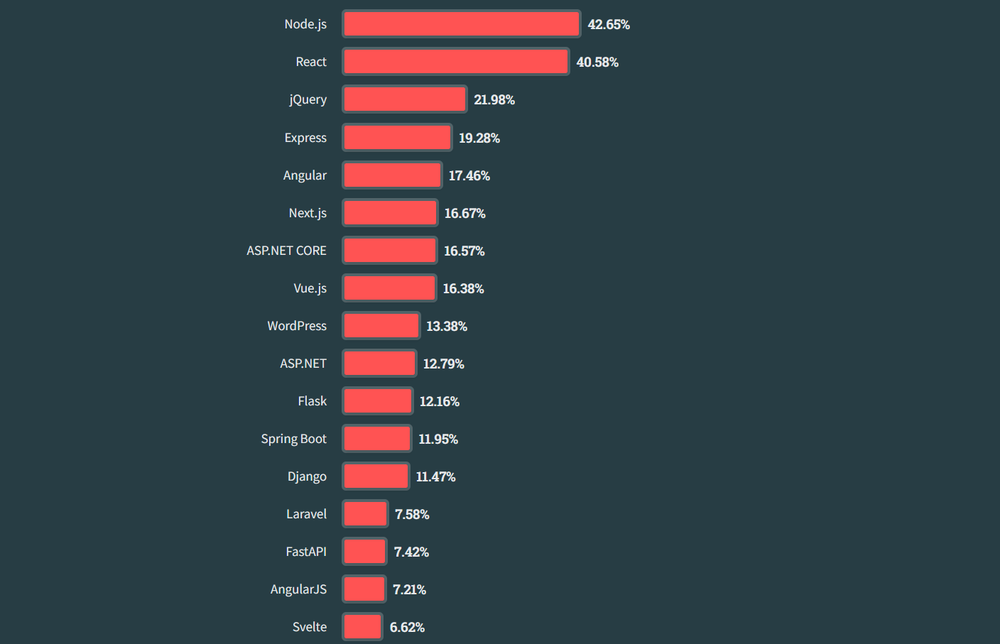

# `Vue.js`: onde o progresso e a flexibilidade se encontram

Esta é uma *overview* de diferentes conceitos pertinentes ao framework `Vue.js`

# Seção 1: Introdução ao Vue.js

## 1.1 O que é Vue.js?

- `Vue` [viu] é um framework progressivo de JavaScript usado para a criação de interfaces de usuário. Em termos arquiteturais, sobretudo em uma base MVC, o `Vue.js` atende às características da camada de visualização, a View. Isto é, ele disponibiliza elementos que facilitam e diversificam o processo de criação de interfaces e de apresentação de conteúdo. Dessa forma, suas características fundamentais são: renderização declarativa, através da extensão do padrão HTML, e reatividade, o qual performa por meio de um processo de observação e atualização.   

### 1.1.1 História

- `Vue.js` foi criado por Evan You após trabalhar para o Google usando o AngularJS em vários projetos. Mais tarde, ele resumiu seu processo de pensamento: "Eu pensei, e se eu pudesse apenas extrair a parte que eu realmente gostei sobre o Angular e construir algo realmente leve." O framework foi anunciado publicamente pela primeira vez em fevereiro de 2014.
- Os nomes das versões são frequentemente derivados de mangás e animes:


### 1.1.2 Framework progressivo
- Um **framework progressivo** é uma abordagem para o desenvolvimento de frameworks que visa flexibilidade e adaptação gradual. Esses, a exemplo do `Vue.js` permitem que os desenvolvedores usem apenas as partes do framework que precisam e estendam ou personalizem conforme necessário. Essa abordagem contrasta com os frameworks monolíticos, que frequentemente fornecem uma grande base de código e muitos recursos, muitos dos quais podem não ser necessários.
  - Vantagens: flexibilidade, leveza, extensibilidade e iniciação rápida.
  - Desvantagens: dependência da comunidade e compatibilidade e interoperabilidade. 

  
  - O código presente na pasta **framework_progressivo** na branch *develop-pedro-correia* mostra uma aplicação bem simples de como o `Vue` pode ser adicionado a uma aplicação já existente.

### 1.1.3 Programação reativa
- Programação reativa é um paradigma de programação declarativa baseado na ideia de processamento de eventos assíncronos e fluxos de dados. Nesse contexto, o `Vue.js` se introduz como um framework de abordagem binária - usando um observador e um gatilho - para implementar um **efeito reativo** em sua estrutura. Seu sistema de reatividade funciona em tempo de execução, ou seja, o processo ocorre enquanto o código é executado no navegador.
  - Vantagens: funciona sem precisar de uma build e há menos casos atípicos.
  - Desvantagens: é limitado à sintaxe do JavaScript.

- **Problema da reatividade:**
```javascript
let A0 = 1
let A1 = 2
let A2 = A0 + A1

console.log(A2) // 3

A0 = 2
console.log(A2) // continua sendo 3
```

- **A teoria da solução:**
```javascript
let A2

function update() {
  A2 = A0 + A1
}
```
- É necessário ter uma função poderosa que possa invocar o update() (o efeito) sempre que A0 ou A1 (as dependências) mudarem:
```javascript
whenDepsChange(update)
```
- Não é possível rastrear a leitura e a escrita de variáveis locais como no exemplo. Simplesmente não há um mecanismo para fazer isso em JavaScript puro. O que se pode fazer, no entanto, é interceptar a leitura e escrita de propriedades de objetos.

- Existem duas maneiras de interceptar o acesso a propriedades no JavaScript: `getters/setters` e `Proxies`. O `Vue 2` utilizava exclusivamente `getters/setters` devido às limitações de suporte do navegador. No `Vue 3`, `Proxies` são usados para objetos reativos e `getters/setters` são usados para `refs`. Aqui está um pseudo-código que ilustra como eles funcionam:
```javascript
function reactive(obj) {
  return new Proxy(obj, {
    get(target, key) {
      track(target, key)
      return target[key]
    },
    set(target, key, value) {
      target[key] = value
      trigger(target, key)
    }
  })
}

function ref(value) {
  const refObject = {
    get value() {
      track(refObject, 'value')
      return value
    },
    set value(newValue) {
      value = newValue
      trigger(refObject, 'value')
    }
  }
  return refObject
}
```

## 1.2 Por que Vue.js?

- Porque `Vue.js` é um framework JavaScript flexível e fácil de aprender, ideal para desenvolvimento web. Ele oferece componentização, reatividade, um ecossistema próspero de bibliotecas e plugins, além de ser leve e rápido. A documentação é abundante e há uma comunidade ativa de desenvolvedores. Além disso, muitas empresas estão adotando `Vue.js` devido à sua facilidade de uso e desempenho.

### 1.2.1 Comparação

- Curva de Aprendizado:
    - React: Apresenta uma curva de aprendizado moderada, contudo, conta com uma comunidade robusta e uma ampla gama de recursos de aprendizado.
    - Angular: Mais complexo em comparação aos outros, requerendo um investimento de tempo para dominar todas as suas funcionalidades.
    - Vue: Mais acessível para iniciantes, oferece uma curva de aprendizado suave e documentação clara.

- Ecossistema e Suporte:

    - React: Possui uma comunidade vasta, uma grande quantidade de recursos disponíveis e é amplamente adotado.
    - Angular: Desfruta de suporte oficial do Google, mas pode ser mais desafiador encontrar soluções para questões menos comuns.
    - Vue: Sua comunidade está em crescimento, oferecendo uma ampla variedade de recursos e suporte.

- Performance e Tamanho do Pacote:

   - React: Apresenta bom desempenho, mas pode necessitar de mais bibliotecas externas para funcionalidades avançadas.
   - Angular: É robusto, porém pode resultar em aplicativos maiores, o que pode impactar na performance.
   - Vue: É leve e rápido, mesmo para pequenos projetos, e permite a adição de funcionalidades conforme necessário.

### 1.2.2 Popularidade

- A seguir estarão algumas imagens mostrando o quão popular `Vue` se situa no momento:

- **Ranking dos frameworks mais usados em 2023 segundo o StackOverflow:**


- **Empresas que usam o framework:**


- **Repositório do `Vue 2` e do `Vue 3` no github respectivamente:**


### 1.2.3 Casos de Uso
#### 1.2.3.1 Single Page Application (SPA)
- Single Page Application (SPA) é um tipo de aplicativo web que opera em uma única página e oferece uma experiência de usuário fluida, sem a necessidade de recarregar a página inteira durante a interação do usuário. `Vue.js` é uma escolha popular para desenvolver SPAs devido à sua arquitetura reativa e sua capacidade de gerenciar eficientemente o estado da aplicação.
- A principal característica de uma SPA é que, após a página inicial ser carregada, todas as outras interações são tratadas dinamicamente no navegador, geralmente usando JavaScript para manipular o DOM e atualizar o conteúdo da página conforme necessário. Isso cria uma experiência de usuário mais rápida e responsiva, sem a necessidade de recarregar a página a cada nova solicitação.
- O Vue fornece bibliotecas e suporte abrangente de ferramentas para construção de SPAs, como:

  - Roteador do lado do cliente
  - Cadeia de ferramentas de compilação extremamente rápida
  - Suporte a IDE
  - Ferramentas de desenvolvimento do navegador
  - Integrações ao TypeScript
  - Utilitários de teste

#### 1.2.3.2 Ionic Vue
- Ionic Vue é uma integração do `Vue.js` com o framework Ionic, que é amplamente utilizado para o desenvolvimento de aplicativos móveis multiplataforma. Com Ionic Vue, os desenvolvedores podem criar aplicativos móveis utilizando as práticas e componentes familiares do `Vue.js`. Ionic Vue fornece uma coleção de componentes de IU otimizados para dispositivos móveis, como botões, listas, navegação e muito mais. Além disso, é possível utilizar recursos como acesso à câmera, GPS e armazenamento local para criar aplicativos móveis completos e funcionais.

#### 1.2.3.3 Electron
- Electron é um framework que permite desenvolver aplicativos desktop multiplataforma utilizando tecnologias web, incluindo HTML, CSS e JavaScript. Com o Vue.js, os desenvolvedores podem criar interfaces de usuário ricas e interativas para aplicativos desktop utilizando componentes Vue. O Vue.js pode ser integrado facilmente em aplicativos Electron para gerenciar a renderização da interface do usuário, manipular o estado da aplicação e responder a eventos do usuário. Isso permite que os desenvolvedores criem aplicativos desktop poderosos e modernos, que funcionam em sistemas operacionais como Windows, macOS e Linux.

## 1.3 Primeiros Passos com Vue.js

### 1.3.1 Usando `Vue.js` pela primeira vez

- Criar um projeto `Vue` é muito simples. Primeiro, você precisa identificar o tipo de projeto que vai trabalhar: legado ou novo. Caso seja o primeiro, o processo ocorrerá através de uma *CDN (Rede de Fornecimento de Conteúdo)*. Por essa maneira, não é preciso realizar nenhum build, você somente precisa informar o link do serviço através de uma tag script no arquivo HTML:
  - `<script src="https://unpkg.com/vue@3/dist/vue.global.js"></script>`
- Esse método é útil para aplicações legado ou para integração com algum framework de backend. Contudo, não será possível utilizar a sintaxe de *Componentes de Arquivo Único (SFC)*. Caso o intuito seja iniciar um projeto novo, utilize o `Vue CLI`, um sistema de linha de comando para o desenvolvimento rápido de projetos em Vue.js. A seguinte, estarão explicitados os passo a passos necessários:


- **Instalação:** Primeiro, é preciso instalar a ferramenta por meio de algum gerenciador de pacotes. Nesse contexto, pode ser tanto o **npm** quanto o **yarn**. 
  ```bash
  npm install -g @vue/cli
  # ou
  yarn global add @vue/cli
  ```
  - Depois da instalação, você terá acesso ao binário vue em seu terminal. Você pode verificar se ele foi propriamente instalado utilizando o comando vue, o qual lhe apresentará uma mensagem de ajuda listando os comandos disponíveis. Para checar a versão que está sendo utilizada em seu computador, é só utilizar o seguinte comando:
  ```bash
  vue --version
  ```

- **Criação de um Novo Projeto:** Agora, você só precisa escrever o seguinte comando no terminal para criar um projeto do zero:
  ```bash
  vue create <nome-do-projeto> 
  # o nome do seu projeto deve ficar dentro das tags
  ```
  - A seguir estão os passos-a-passos de como criar um projeto em `Vue`:

  - Caso escolha uma opção *default*, o processo já vai automaticamente:

  
  - Caso decida escolher manualmente:
  
  

  
  

  - Pronto! O seu projeto em `Vue` foi criado com sucesso!

  - É possível também instalar o `Vue.js` e criar um projeto ao mesmo tempo usando o seguinte comando:
  ```bash
  npm create vue@latest
  ```
- **Estrutura do Projeto:** um projeto `Vue` é composto por diferentes pastas e arquivos, a seguir estão alguns deles:


  - **node_modules:** Esta pasta contém as dependências do projeto, instaladas via npm ou Yarn.

  - **public:** Aqui estão os arquivos estáticos do projeto, como HTML, imagens e outros recursos que não precisam ser processados pelo webpack.

  - **src:** Esta é a pasta principal onde o código-fonte do aplicativo Vue está localizado.

     - **assets:** Contém arquivos de mídia como imagens, ícones, etc.

     - **components:** Aqui estão os componentes Vue reutilizáveis que compõem o aplicativo.

     - **App.vue:** Este arquivo é o componente raiz do aplicativo Vue. Ele contém a estrutura básica do aplicativo e é responsável por renderizar os outros componentes.

     - **main.js:** Este é o arquivo de entrada principal do aplicativo Vue. Ele inicializa a instância Vue e monta o aplicativo na página HTML.

  - **babel.config.js:** Este arquivo contém a configuração do Babel para o projeto Vue. Ele define como o Babel deve transpilar o código JavaScript.
  - **jsonconfig.js:** Configura a integração do Visual Studio Code com projetos JavaScript.
  - **package-lock.json:** Registra as versões exatas das dependências instaladas pelo npm, garantindo consistência entre ambientes
  - **package.json:** Este arquivo contém metadados do projeto e as dependências do npm. Ele também inclui scripts para executar tarefas comuns, como iniciar o servidor de desenvolvimento, compilar o código, etc.
  - **vue.config.js:** Configura o ambiente de compilação do Vue CLI, permitindo personalização das opções de compilação, webpack e ambiente de desenvolvimento.

- **Atualização da versão:** Para atualizar o pacote global do Vue CLI, utilize o comando:
  ```bash
  npm update -g @vue/cli
  # OR
  yarn global upgrade --latest @vue/cli
  ```

## 1.4 Primeiro Componente Vue

- Componentes nos permitem dividir a interface do usuário em partes independentes e reutilizáveis e pensar em cada parte isoladamente. É muito semelhante a como aninhamos elementos HTML nativos, mas o `Vue.js` implementa seu próprio modelo de componente que nos permite encapsular conteúdo e lógica personalizados em cada componente. Geralmente, os componentes são estruturados em uma forma de árvore:

- Ao criar um projeto Vue com uma build, é possível utilizar a sintaxe de **Componentes de Arquivo-Único (SFC)**, com extensão *.vue*.
- A seguir há um exemplo de componentes pai e filho se comunicando através da opção *props*:
- **Componente-Pai**:
```vue
<template>
  <MeuComponente :nome="nome"></MeuComponente>
</template>

<script>
import MeuComponente from './components/MeuComponente'

export default {
  name: 'App',
  components: {
    MeuComponente
  },
  data() {
    return {
      nome: "Pedro"
    }
  }
}
</script>

<style></style>
```

- **Componente-Filho**:
```vue
<template>
    <h1>Olá, eu sou o seu primeiro componente!</h1>
    <p>Prazer em lhe conhecer, {{ nome }}</p>
</template>

<script>
export default {
    props: ['nome']
}
</script>

<style></style>
```
# Seção 2: Arquitetura do Vue.js

## 2.1 Estrutura de Componentes do Vue.js

- A estrutura básica de um componente *.vue* é a seguinte:
 ```vue
   <template>
     <div>{{ message }}</div>
   </template>

   <script>
   export default {
     data() {
       return {
         message: 'Olá Vue!'
       }
     }
   }
   </script>

   <style>
   div {
    color: #fff;
    background-color: #000;
   }
   </style>
```

- Cada instância de componente `Vue` passa por uma série de etapas de inicialização quando é criada - por exemplo, ela precisa configurar a observação de dados, compilar o modelo, montar a instância no DOM e atualizar o DOM quando os dados mudam. No processo, também executa funções chamadas de **ganchos (hooks)** do ciclo de vida, dando aos usuários a oportunidade de adicionar seu próprio código em estágios específicos.


## 2.2 Sistema Reativo do Vue.js
### 2.2.1 Entendendo a reatividade
- Nessa seção, abordaremos como a reatividade funciona em uma aplicação `Vue` seguindo as duas APIs disponíveis. 

#### 2.2.1.1 Composition API
- Nessa API, a maneira recomendada de declarar estado reativo é usando a função ref():

```javascript
import { ref } from 'vue'
const count = ref(0)
```

- ref() recebe o argumento e o retorna envolvido em um objeto ref com uma propriedade *.value*:

```javascript
const count = ref(0)

console.log(count) // { value: 0 }
console.log(count.value) // 0

count.value++
console.log(count.value) // 1
```

- Quando você usa um *ref* em um modelo e altera o valor do *ref* depois, o `Vue` detecta automaticamente a mudança e atualiza o DOM de acordo. Isso é possível com um sistema de reatividade baseado no rastreamento de dependências. Quando um componente é renderizado pela primeira vez, o `Vue` rastreia todos os *refs* que foram usados durante a renderização. Mais tarde, quando um *ref* é alterado, ele aciona uma nova renderização para os componentes que o estão rastreando. No JavaScript padrão, não há maneira de detectar o acesso ou a alteração de variáveis simples. No entanto, podemos interceptar as operações de obtenção e configuração das propriedades de um objeto usando métodos **getter** e **setter**. A propriedade *.value* dá ao `Vue` a oportunidade de detectar quando um *ref* foi acessado ou alterado. Por baixo dos panos, o `Vue` realiza o rastreamento em seu **getter** e realiza o acionamento em seu **setter**. 

#### 2.2.1.2 Options API
- Nessa API, utiliza-se a opção *data* para declarar o estado reativo de um componente. O valor da opção deve ser uma função que retorna um objeto. O `Vue` chamará a função ao criar uma nova instância do componente e envolverá o objeto retornado em seu sistema de reatividade. Todas as propriedades deste objeto são chamadas na instância do componente (`this` em métodos e ganchos de ciclo de vida):

```javascript
export default {
  data() {
    return {
      count: 1
    }
  },

  mounted() {
    console.log(this.count) // 1
    this.count = 2
  }
}
```

- Em `Vue 3`, os dados são tornados reativos através do uso de Proxies do JavaScript.

### 2.2.1.3 Atualização no DOM
- Quando você altera o estado reativo, o DOM é atualizado automaticamente. No entanto, deve-se notar que as atualizações do DOM não são aplicadas de forma síncrona. Em vez disso, o `Vue` as armazena em buffer até o "próximo tick" no ciclo de atualização para garantir que cada componente seja atualizado apenas uma vez, independentemente de quantas alterações de estado você tenha feito.Para aguardar a conclusão da atualização do DOM após uma alteração de estado, você pode usar a API global nextTick():
```javascript
import { nextTick } from 'vue'

export default {
  methods: {
    async increment() {
      this.count++
      await nextTick()
      // agora a DOM está atualizada
    }
  }
}
```

### 2.2.2 Observadores e propriedades computadas
- No `Vue.js`, as "propriedades computadas" são propriedades cujos valores são derivados de outras propriedades de dados. Elas são como funções que são armazenadas em cache com base em suas dependências. As propriedades computadas são definidas nas opções do componente `Vue` e retornam um valor com base nas propriedades de dados da instância `Vue`.
- A principal vantagem de usar propriedades computadas é que elas oferecem uma maneira de realizar manipulação de dados ou cálculos enquanto mantêm o modelo simples e legível. As propriedades computadas são reativas, o que significa que são atualizadas automaticamente sempre que suas dependências mudam.
- Em vez de uma propriedade computada, podemos definir a mesma função como um *método*. Para o resultado final, as duas abordagens são de fato exatamente iguais. No entanto, a diferença é que as propriedades computadas são armazenadas em cache com base em suas dependências reativas. Uma propriedade computada só será reavaliada quando algumas de suas dependências reativas tiverem mudado. Em comparação, a chamada de métodos sempre rodará a função quando for preciso re-renderizar elementos

```javascript
export default {
  data() {
    return {
      count: 1
    }
  },
  computed: {
    contagemVezesDez() {
      return this.count * 10
    }
  }
}
```

- Isso também significa que a seguinte propriedade computada nunca será atualizada, porque `Date.now()` não é uma dependência reativa:

```javascript
computed: {
  now() {
    return Date.now()
  }
}
```

### 2.2.3 Virtual DOM

- O **DOM virtual (VDOM)** é um conceito de programação onde uma representação ideal, ou "virtual", de uma interface do usuário é mantida na memória e sincronizada com o "real" DOM. O conceito foi pioneirado pelo React e foi adotado em muitos outros frameworks com diferentes implementações, incluindo o `Vue`.
- O **DOM virtual** é mais um padrão do que uma tecnologia específica, então não há uma implementação canônica única. Podemos ilustrar a ideia usando um exemplo simples:

```javascript
const vnode = {
  type: 'div',
  props: {
	id: 'olá'
  },
  children: [
	/* outros vnodes */
  ]
}
```

- Aqui, vnode é um objeto JavaScript simples (um "nó virtual") representando um elemento `<div>`. Ele contém todas as informações que precisamos para criar o elemento real. Ele também contém mais nós filhos virtuais, o que o torna a raiz de uma árvore **DOM virtual**.
- Um renderizador em tempo de execução pode percorrer uma árvore **DOM virtual** e construir a partir dela uma árvore **DOM real**. Esse processo é chamado de **montagem**.
- Se tivermos duas cópias de árvores **DOM virtuais**, o renderizador também pode percorrer e comparar as duas árvores, descobrindo as diferenças e aplicando essas alterações ao **DOM real**. Esse processo é chamado de **patch**.
- O principal benefício do **DOM virtual** é que ele dá ao desenvolvedor a capacidade de criar, inspecionar e compor estruturas de UI desejadas de forma declarativa, deixando a manipulação direta do DOM para o renderizador.

- A implementação do **DOM virtual** no `React` e na maioria das outras implementações de **DOM virtual** são puramente em tempo de execução: o algoritmo de reconciliação não pode fazer suposições sobre a árvore **DOM virtual** de entrada, então ele tem que percorrer totalmente a árvore e diferenciar as propriedades de cada nó virtual para garantir a correção. Além disso, mesmo que uma parte da árvore nunca mude, novos nós virtuais são sempre criados para eles em cada re-renderização, resultando em pressão de memória desnecessária. Este é um dos aspectos mais criticados do **DOM virtual**: o processo de reconciliação um tanto bruto sacrifica eficiência em troca de declaratividade e correção.
- Contudo, no `Vue`, o framework controla tanto o compilador quanto o tempo de execução. Isso nos permite implementar muitas otimizações em tempo de compilação que apenas um renderizador fortemente acoplado pode aproveitar. O compilador pode analisar estaticamente o modelo e deixar dicas no código gerado para que o tempo de execução possa fazer atalhos sempre que possível. Ao mesmo tempo, ainda preservamos a capacidade do usuário de voltar para a camada da função de renderização para um controle mais direto em casos extremos. O nome desse conceito híbrido é **DOM Virtual Informado pelo Compilador (Compiler-Informed Virtual DOM)**.


## 2.3 Comunicação Entre Componentes
- Reforcem que a comunicação eficaz entre componentes é crucial para o desenvolvimento de aplicações Vue.
- Procurem cobrir os diferentes métodos disponíveis para a comunicação entre componentes, incluindo props, eventos personalizados e a injeção de dependência.

### 2.3.1 Props
- Todas as props formam uma ligação unidirecional descendente entre a propriedade filho e a propriedade pai, ou seja, quando a propriedade pai é atualizada, a mudança fluirá para o filho, mas não o contrário. Isso impede que os componentes filhos alterem acidentalmente o estado do pai, o que pode tornar o fluxo de dados do aplicativo mais difícil de entender.
- Além disso, toda vez que o componente pai é atualizado, todas as props no componente filho serão atualizadas com o valor mais recente. Isso significa que você não deve tentar alterar uma prop dentro de um componente filho.
- **Componente-Pai**:

```vue
<template>
  <MeuComponente :idade="idade"></MeuComponente>
</template>

<script>
import MeuComponente from './components/MeuComponente'

export default {
  name: 'App',
  components: {
    MeuComponente
  },
  data() {
    return {
      idade: 20
    }
  }
}
</script>

<style></style>
```
- **Componente-Filho**:

```vue
<template>
    <h1>Parabéns! Agora você tem {{ idade }} anos.</h1>
</template>

<script>
export default {
    props: ['idade']
}
</script>

<style></style>
```

## 2.3.2 Eventos personalizados
- Em Vue.js, um evento personalizado é uma forma de os componentes filhos se comunicarem com os componentes pais. Os componentes `Vue` podem emitir eventos personalizados usando o método $emit, e os componentes pais podem ouvir esses eventos usando a diretiva `v-on`.
  - **Componente-Filho (Emitindo Evento Personalizado)**: Em um componente filho, você pode usar o método `$emit` para emitir um evento personalizado. O evento personalizado pode incluir dados que você deseja passar para o componente pai.
```vue
<template>   <!-- <MyComponent> template -->
<button @click="$emit('aumentar', 1)"><slot></slot></button>
</template>

<script>
export default {
}
</script>

<style></style>
```
  - **Componente-Pai (Ouvindo o Evento Personalizado)**: No componente pai, você pode usar a diretiva `v-on` para ouvir o evento personalizado emitido pelo componente filho. Quando o evento ocorre, o método associado no componente pai será executado.

```vue
<template>
  <MeuComponente @aumentar="(x) => count += x">Incrementar</MeuComponente>
  <p> {{ count }} </p>
</template>

<script>
import MeuComponente from './components/MeuComponente'

export default {
  name: 'App',
  components: {
    MeuComponente
  },
  data() {
    return {
      count: 0
    }
  }
}
</script>

<style></style>
```

## 2.3.3 Diretiva `v-model`
- `v-model` é uma diretiva no `Vue.js` que é usada principalmente para criar vinculações bidirecionais entre dados e elementos de formulário. Ele fornece uma maneira fácil de sincronizar o estado de uma variável de dados `Vue` com um elemento de entrada, como `<input>`, `<textarea>`, `<select>`, etc.
- Quando você usa `v-model` em um elemento de formulário, o `Vue` cria automaticamente uma vinculação entre o valor do elemento de entrada e a propriedade de dados especificada pelo `v-model`.

```vue
<template>
    <h1>Veja a mágica acontecer!</h1>
    <input v-model="palavra" type="text">
</template>

<script>
export default {
    data() {
      return {
        palavra: ''
      }
    }
}
</script>

<style></style>
```

## 2.3.4 Slots
- em `Vue.js`, os *slots* são uma funcionalidade poderosa que permite criar componentes de forma flexível e reutilizável, possibilitando a passagem de conteúdo do componente pai para o componente filho. Os *slots* permitem que você injete conteúdo HTML ou outros componentes em áreas específicas de um componente filho a partir de um componente pai.
- O conteúdo do slot tem acesso ao escopo de dados do componente pai, pois é definido no pai. Por exemplo:  

- **Componente-Pai**:
```vue
<template>
    <p>Vocês já viram {{ meuNome }}</P>
    <ComponenteFilho>
      <button>{{ meuNome }}</button>
    </ComponenteFilho>
</template>

<script>
export default {
  data() {
    return {
      meuNome: "O maior botão"
    }
  }
}
</script>

<style></style>
```


- **Componente-Filho**:
```vue
<template>
    <h1>Insira um botão aqui!</h1>
    <slot></slot>
</template>

<script>
export default {
}
</script>

<style></style>
```

- O conteúdo do slot não tem acesso aos dados do componente filho. Expressões nos modelos Vue só podem acessar o escopo em que são definidas, de acordo com o escopo léxico do JavaScript.

- **Slots Nomeados e Não Nomeados**: Você pode ter slots nomeados e não nomeados. Os slots nomeados permitem que você especifique onde o conteúdo deve ser inserido de acordo com o nome do slot. Já os slots não nomeados são usados para conteúdo que não é especificamente direcionado para um slot nomeado.

- **Componente-Pai**:
```vue
<BaseLayout>
  <template #header> // #header = v-slot:header
    <h1>Título</h1>
  </template>

  <template #default>
    <p>Parágrafo.</p>
  </template>

  <template #footer>
    <p>Rodapé</p>
  </template>
</BaseLayout>
```

- **Componente-Filho**:
```vue
<div class="container">
  <header>
    <slot name="header"></slot>
  </header>
  <main>
    <slot></slot>
  </main>
  <footer>
    <slot name="footer"></slot>
  </footer>
</div>
```

- **Slots com Escopo (Scoped Slots)**: Os slots com escopo permitem que o componente pai acesse dados e métodos do componente filho. Isso é útil quando você deseja fornecer mais contexto ou funcionalidade ao conteúdo passado para o slot.
- **Componente-Pai**:

```vue
<template>
  <MeuComponente v-slot="slotProps">
  {{ slotProps.text }} {{ slotProps.count }}
</MeuComponente>
</template>

<script>
import MeuComponente from './components/MeuComponente'

export default {
  name: 'App',
  components: {
    MeuComponente
  }
}
</script>

<style>

</style>

```

- **Componente-Filho**:
```vue
<template>   <!-- <MyComponent> template -->
<div>
  <slot :text="greetingMessage" :count="1"></slot>
</div>
</template>

<script>
export default {
    data() {
        return {
            greetingMessage: "oi"
        }
    }
}
</script>

<style></style>
```

### 2.3.5 Provedores (provide) e Injetores (inject): 
- Normalmente, quando precisamos passar dados do pai para um componente filho, usamos `props`. No entanto, imagine o caso em que temos uma árvore de componentes grande e um componente profundamente aninhado precisa de algo de um componente ancestral distante. Com apenas `props`, teríamos que passar a mesma propriedade por toda a cadeia de pais:

- Podemos resolver esse problema com o uso de `provide` e de `inject`. Um componente pai pode servir como provedor de dependências para todos os seus descendentes. Qualquer componente na árvore de descendentes, independentemente de quão profundo esteja, pode injetar dependências fornecidas pelos componentes acima na sua cadeia de pais.

- Para que esse sistema de transferência de dados funcione, é preciso utilizar a opção `project` - ela fornece os dados para os descendentes - e a opção `inject` - responsável por inserir os dados do pai no componente filho, você pode acessar esse dado pela propriedade de `data()`.
- **Componente-Pai**:

```javascript
export default {
  provide: {
    message: 'hello!'
  }
}
```
- **Componente-Filho**:
```javascript
export default {
  inject: ['message'],
  created() {
    console.log(this.message) // injected value
  }
}
```

# Seção 3: Padrões de Projeto e Implementação Avançada no Vue.js

Os padrões de design são soluções confiáveis para problemas comuns enfrentados pelos desenvolvedores de software ao construir sistemas. Eles não são específicos para uma linguagem de programação ou estrutura, mas servem como ferramentas gerais para resolver problemas. Em desenvolvimento frontend, os padrões de design podem oferecer soluções reutilizáveis para problemas recorrentes na construção de interfaces de usuário e aplicativos web.

## 3.1 Padrões de Projeto no Vue.js

Vue.js é um framework baseado em componentes, onde o conceito de componentes já é um padrão de design por si só. Componentes são unidades de código autocontidas que podem ser reutilizadas em toda a aplicação, promovendo modularidade e manutenibilidade. Além da estrutura baseada em componentes, Vue utiliza o conceito de data binding reativo. Mudanças nos dados de um componente são automaticamente refletidas na interface do usuário, resultando em código mais conciso e legível. Vue também oferece suporte a diretivas personalizadas, que podem ser anexadas como funções JavaScript a elementos HTML para adicionar funcionalidades personalizadas. Essa flexibilidade permite a implementação de vários padrões de design, como o padrão observador e o padrão de gerenciamento de estado.

### 3.1.1 Padrões de Design no Vue podem:
- Oferecer uma abordagem estruturada para resolver problemas, reduzindo a probabilidade de erros e eliminando a necessidade de soluções personalizadas.
- Aprimorar a reutilização de código, evitando a reinvenção de soluções para problemas semelhantes. Os padrões ajudam a desacoplar vários componentes do sistema.
- Melhorar a comunicação, estabelecendo um vocabulário comum por meio de padrões de design que simplificam a colaboração e facilitam a compreensão do código entre os desenvolvedores.
- Promover práticas de codificação uniformes, garantindo que a base de código mantenha um estilo e estrutura consistentes, mesmo quando vários desenvolvedores contribuem para um projeto.
- Melhorar a escalabilidade, simplificando a distribuição e o gerenciamento, o que ajuda a lidar com a complexidade e garantir a adaptabilidade à medida que o projeto cresce e os requisitos mudam.
- Aprimorar a manutenção, pois o código estruturado com padrões de design geralmente é mais fácil de manter. Desenvolvedores podem consultar padrões estabelecidos ao lidar com problemas ou fazer alterações, evitando soluções personalizadas complexas e difíceis de entender.
- Elevar a qualidade do código, ao aplicar ou incentivar melhores práticas por meio de padrões de design, como encapsulamento, abstração e polimorfismo. Isso resulta em código mais legível, manutenível e extensível.
- Servir como uma forma de documentação integrada. O uso de padrões de design permite que qualquer pessoa revisando seu código reconheça os padrões utilizados, oferecendo insights sobre a arquitetura e o comportamento do sistema, mesmo quando a documentação é limitada.
- Esses benefícios economizam tempo e esforço para os desenvolvedores, destacando o papel crucial dos padrões de design na engenharia e desenvolvimento de software. Agora, avancemos para alguns padrões avançados que podem ser aplicados no Vue para resolver diferentes problemas.


### 3.1.2 Padrão Observer

O padrão observer é um padrão de design comportamental que permite criar sistemas pouco acoplados, fáceis de manter e estender. É especialmente útil em aplicações onde é necessário notificar vários objetos sobre mudanças de estado em um único objeto. Este padrão, também conhecido como padrão observável, permite que um objeto notifique seus dependentes ou observadores sobre quaisquer mudanças de estado. O sujeito, ou objeto observável, mantém uma lista de seus observadores e chama seus métodos de atualização sempre que há mudanças em seu estado. No contexto do Vue, o padrão observador é usado para gerenciar reatividade e lidar com atualizações dinâmicas na interface do usuário. Vejamos um exemplo que exibe uma notificação toda vez que uma caixa de seleção é marcada ou desmarcada.

### 3.1.3 Implementação do Vue.js
O Vue.js integra o padrão observer de forma transparente para gerenciar a reatividade dos dados em sua aplicação. Veja como funciona:
1. Dados como Sujeitos: Quando você declara propriedades de dados em um componente Vue, o Vue as transforma internamente em objetos reativos. Estes objetos reativos agem como sujeitos no padrão observer.
2. Rastreamento de Dependências: O Vue rastreia automaticamente as dependências entre os componentes e os dados dos quais eles dependem. Ele usa uma técnica chamada coleta de dependências para identificar quais componentes precisam ser renderizados novamente após a modificação dos dados.
3. Sistema de Reatividade: Quando um objeto reativo (sujeito) passa por uma mudança (mutação), o sistema de reatividade do Vue dispara um processo de notificação.
4. Atualizações de Componentes: Os componentes que se inscrevem (observam) os dados alterados são alertados pelo Vue. Eles recebem os dados atualizados e renderizam novamente seus templates, refletindo as mudanças na interface do usuário.

#### Exemplo Prático:
```javascript
class Subject {
    __value
    constructor(value) {
        this.__value = value
        this.__observers = []
    }
    set value(newValue) {
        this.__value = newValue
        for (const observer of this.__observers) {
            observer.update(this)
        }
    }
    get value() {
        return this.__value
    }
    subscribe(observer) {
        this.__observers.push(observer)
    }
}

class Observer {
    update(subject) {
        console.log(`new value: ${subject.value}`)
    }
}
```
### 3.1.3 Implementação do Vue.js
 No código, você pode observar que após cada definição de valor para nosso sujeito, o método update será executado para todos os seus observadores. Agora, vamos criar um sujeito e um observador para testar este código.


Agora, como você pode ver, nosso observador é notificado e registra o novo valor do sujeito no console.


### Sistema de Reatividade 
Um ref ou propriedade reativa (sujeito) armazena um objeto dep (dependência), que é essencialmente um conjunto de efeitos (observadores no código acima). Quando recuperamos um valor de um ref, o método track é chamado. Por outro lado, ao atribuir um valor a um ref, o método trigger é invocado, indicando que ocorreu uma alteração na propriedade reativa. Em breve, discutiremos sobre efeitos, tracks e triggers.
Efeito (Effect)
- Em termos simples, um efeito no Vue pode ser visto como um observador.
  
```class Effect {
  constructor(fn) {
    this.fn = fn
  }
  // for a computed it will update inner value and
  // for a component it will render needed part of that
  run() {
    return this.fn()
  }
  ...
}
```


 O objeto effect, quando instanciado, recebe uma função em seu construtor. A principal responsabilidade do efeito é observar quaisquer alterações nas propriedades reativas dentro dessa função. 
### Métodos Track e Trigger
- Quando o valor de uma propriedade reativa é acessado dentro de um novo escopo de código, como uma função de renderização ou método getter computado, a função track é acionada. O ActiveEffect é adicionado aos dependentes da propriedade reativa. Nesse cenário, o ActiveEffect é um efeito inicializado usado em um computado ou componente para detectar alterações nas propriedades reativas. Esse mecanismo garante que o computado ou componente esteja ciente de quaisquer modificações na propriedade reativa.

```
function track(target) {
  // component.effect or computed.effect is equal to activeEffect
  // it is actually a subscriber
  target.dep.add(activeEffect)
}
```

- Quando o valor de uma propriedade reativa é alterado, a função trigger é chamada. No entanto, a função trigger executa apenas os efeitos associados a ela se o novo valor for diferente do valor antigo. Dessa forma, o trigger garante que apenas os efeitos dependentes do valor alterado sejam executados.

```
function trigger(target) {
  const effects = [...target.dep]
  for (const effect of effects) {
    // we will run effect of our reactive property. one of this effects
    // are computed.effect. and now computed can update its inner value
    effect.run()
  }
}
```

## 4 Técnicas Avançadas de Implementação

### 4.1 - Gerenciamento de Estado com Vuex

-**Introdução ao Vuex**: 
 - O Vuex é um padrão de gerenciamento de estado + biblioteca para aplicações Vue.js. Ele serve como um store centralizado para todos os componentes em uma aplicação, com regras garantindo que o estado só possa ser mutado de forma previsível.Inspirado na arquitetura Flux, o Vuex proporciona uma estrutura organizada e previsível para lidar com o estado da aplicação.
De acordo com a documentação oficial do Vuex (2019), trata-se de “um padrão de gerenciamento de estado + biblioteca para aplicativos Vue.js”. Segundo Schmitz e Georgii (2016), uma forma simples de compreender o Vuex dentro do um projeto é através de seu conceito de store. A Vuex serve como uma “loja” de dados para sua aplicação, permitindo que todos os componentes tenham acesso a um determinado estado (ou state), pois todos os estados ficam centralizados dentro dessa loja. Vuex também permite uma boa organização do projeto, permitindo ainda modularizar a store, para organizar quais estados pertencem a uma determinada entidade da aplicação. Vuex também se integra com a extensão para navegadores do Vue.js, chamada Vue DevTools, exibida na Figura, oferecendo recursos interessantes, como a depuração através do histórico de estado, também conhecida como time travel (VUEX, 2019).


- Segundo Vuex (2019), a arquitetura empregada pelo Vuex possui o seguinte fluxo: os componentes podem disparar ações (actions), que por sua vez podem ou não fazer requisições a APIs no back-end (opcionalmente, dependendo da aplicação). Tal ação pode realizar um commit nos dados, o que irá chamar uma mutação (mutation). Neste momento, o evento é lançado no Vue DevTools e poderá ser observado. Por fim, a mutation efetivamente armazena 60 o dado no state. Esse state poderá ser acessado por meio de um getter em qualquer componente da aplicação.


### 4.2 - Mas o que é um Padrão de Gerenciamento do Estado?


É uma aplicação independente com as seguintes partes:
- O estado (state), que é a fonte da verdade que direciona nossa aplicação;
- A view, que é apenas um mapeamento declarativo do estado;
- As ações (actions), que são as possíveis maneiras pelas quais o estado pode mudar em reação às interações dos usuários da view.
- Esta é uma representação simples do conceito de "fluxo de dados unidirecional" (one-way):
  
  

 A simplicidade é quebrada rapidamente quando temos vários componentes que compartilham um estado em comum. Vamos imaginar que múltiplos componentes dependam do mesmo pedaço de estado do exemplo acima: neste caso, estariam dependendo do count. E ações de diferentes views podem precisar mudar o mesmo pedaço de estado. Já notamos rapidamente algumas dificuldades como, por exemplo, passar propriedades (props) para componentes profundamente aninhados. Porém, essa estratégia não funcionaria para componentes irmãos. Já falando das ações para mudanças do estado, a solução seria alcançar referências diretas da instância pai/filho ou tentar alterar e sincronizar várias cópias do estado por meio de eventos.

### 4.3 - E então, surge o Vuex
O Vuex extrai o estado compartilhado dos componentes e o gerencia em um singleton global. Com isso, a árvore de componentes se torna uma grande “view”, e qualquer componente pode acessar o estado ou acionar ações, não importando onde elas estejam na árvore.

Com tal separação e definição, os conceitos envolvidos no gerenciamento do estado, com a aplicação de certas regras, transforma nosso código em algo mais estruturado e com sustentabilidade. Esta é a ideia básica por trás do Vuex, inspirado no Flux, Redux e The Elm Architecture. Ao contrário dos outros padrões, o Vuex também é uma implementação da biblioteca adaptada especificamente para o Vue.js aproveitar as vantagens de seu sistema de reatividade granular para atualizações eficientes.

### 4.4 - Introdução ao Flux
A arquitetura Flux é um padrão de arquitetura de software desenvolvido pelo Facebook para criar aplicações web robustas e escaláveis. Ela foi projetada para resolver desafios específicos encontrados na construção de interfaces de usuário (UI) complexas, especialmente em ambientes onde o estado da aplicação é difícil de gerenciar.
O Flux traz um conceito de fluxo unidirecional de dados onde a interação do usuário vai provocar um evento no formato de uma action específica. Essa ação vai despachar o evento para a modificação de um dados, que vai modificar o store de dados e, por fim, este vai enviar um evento de atualização da visualização. Ao final a visualização vai consumir os dados das mais variadas formas.A arquitetura Flux é composta por quatro partes principais:
- Actions (Ações):
As ações são eventos que descrevem uma intenção de modificar o estado da aplicação. Elas são criadas pelos componentes da UI em resposta a interações do usuário ou a outros eventos. Cada ação possui um tipo que descreve a natureza da mudança no estado.
- Dispatcher (Despachante):
O despachante é responsável por receber ações e garantir que elas sejam enviadas para todos os "stores" da aplicação. Ele atua como um hub central que distribui as ações para os devidos "stores" registrados.
- Stores (Armazéns):
Os "stores" contêm o estado da aplicação e lógica de negócios relacionada. Eles respondem a ações específicas e atualizam seu estado interno de acordo. Os "stores" emitem um evento sempre que seu estado é modificado.
- Views (Visões):
As visões são componentes da UI que reagem às mudanças no estado da aplicação. Elas se registram nos "stores" relevantes para receber atualizações quando o estado muda. Quando uma visão detecta uma mudança, ela atualiza a interface do usuário para refletir o novo estado.


-**Escalando a arquitetura Flux**
Expandindo o conceito sobre o store ele possui toda a lógica de neǵocio da aplicação e pode ser composto por vários stores onde cada store é responsável por um domínio específico da aplicação. Além disso, a visualização já consegue ser composta por vários níveis de visualização que irão para o cliente e, talvez, em somente uma parcela exista um ponto passível de chamar uma ação.
Escalando essa aplicação conseguimos ter uma visão singular de como funcionam os possíveis caminhos que os dados percorrem para formar uma visualização para o usuário final. Acho que vale a pena destacar como fica claro a reusabilidade de código e a separação lógica tanto dos domínios quanto dos componentes visuais.


-**Sincronia**
Toda as modificações de dados são dadas de forma síncrona e quando acontece alguma operação assíncrona, como por exemplo ajax, estas disparam uma action que executa todo o fluxo previsto pela arquitetura. Além disso, é possível que suas ações ainda disparem ações assíncronas da API (do browser ou do node). Em resumo, quando há uma chamada tanto síncrona quanto assíncrona o fluxo dos dados fica bem explícito dentro da aplicação e fácil de ser depurado quando há lógica incorretas no seu código.

-**Inversão de controle**
Nenhuma outra parte do código precisa conhecer como modificar o estado da aplicação pois os stores fazer isso internamente através das ações, ou seja, toda a lógica de atualizar os dados está contida no store. Além disso, como as atualizações dos stores só acontecem em resposta às ações, isso sincronamente, testar stores se torna demasiadamente simples pois você terá um “estado inicial”, uma ação e um “estado final”.

-**Ações mais semânticas**
Como os stores atualizam a si mesmos em resposta às ações, as ações tendem a ser semanticamente mais descritivas. Por exemplo, em uma aplicação flux de notas fiscais eletrônicas você poderá abrir a visualização de uma nota através de uma ação “TOGGLE_VIEW_NFE”, passando o identificador da nota fiscal como argumento. A ação em si não sabe como efetuar a atualização mas descreve plenamente o que espera que seja feito.
Por causa desta propriedade você raramente terá que trocar as suas ações, apenas como o store responde a essas ações. Quanto mais a sua aplicação se aproxima de um conceito de um Saas, quanto mais pontos de interação essa aplicação tenha tenha, a ação “TOGGLE_VIEW_NFE” se tornará semanticamente válida.
- O Vuex simplifica a implementação do padrão Flux em aplicações Vue.js, fornecendo uma estrutura clara e previsível para o gerenciamento de estado. A união do Vue.js e do Vuex oferece um ecossistema poderoso para o desenvolvimento de aplicações web reativas e escaláveis. O conceito de fluxo unidirecional de dados promovido pela arquitetura Flux, e implementado pelo Vuex, contribui significativamente para a organização e manutenção de projetos de larga escala.

- ### 4.5 Quando usar o Vuex?
Embora o Vuex nos ajude a lidar com o gerenciamento de estado compartilhado, ele também vem com o custo de mais conceitos e códigos repetitivos. É uma escolha de prós e contras entre produtividade de curto e longo prazo. Se você nunca construiu um SPA em grande escala e for direto para o Vuex, ele pode parecer verboso e desanimador. Isso é perfeitamente normal - se a sua aplicação é simples, você provavelmente ficará bem sem o Vuex. Um simples store pattern pode ser tudo que você precisa. Mas, se você está criando um SPA de médio a grande porte, é provável que tenha encontrado situações que fazem você pensar em como lidar melhor com o estado fora de seus componentes Vue, e o Vuex será naturalmente o próximo passo para você. Há uma boa citação de Dan Abramov, o autor do Redux:
As bibliotecas Flux são como óculos: você saberá quando precisar delas.
A decisão de usar o Vuex depende da complexidade da aplicação. Para aplicações simples, um padrão de gerenciamento de estado básico pode ser suficiente. No entanto, à medida que a aplicação cresce em escala e complexidade, o Vuex torna-se uma escolha valiosa.
O Vuex oferece benefícios significativos no gerenciamento de estados compartilhados, mesmo que isso venha acompanhado de conceitos adicionais e algum código repetitivo. A escolha entre produtividade de curto e longo prazo depende do tamanho e escopo da aplicação em questão.

-**Benefícios do Vuex:**
- Centralização do Estado: O Vuex centraliza o estado da aplicação, evitando estados dispersos e facilitando a manutenção.
- Rastreabilidade e Preditibilidade: A arquitetura Flux do Vuex oferece um fluxo de dados unidirecional, tornando as mudanças de estado previsíveis e rastreáveis.
- Facilita a Colaboração entre Componentes: Componentes podem acessar e modificar o estado de forma clara e organizada, simplificando a colaboração entre diferentes partes da aplicação.
- Suporte para Ações Assíncronas: O Vuex facilita a execução de ações assíncronas, mantendo a coesão na manipulação do estado


-**Exemplo de Uso**:
Veja como fica o arquivo "/src/main.js":


Arquivo "/src/store/index.js":


Arquivo "/src/App.vue":


Arquivo "/src/components/Todo.vue":


Arquivo "/src/components/Todos.vue":


### 4.2 Renderização Condicional e Listas

A renderização condicional e manipulação de listas são aspectos cruciais na construção de interfaces de usuário dinâmicas e interativas em Vue.js. Nesta seção, exploraremos técnicas avançadas, destacando o uso de diretivas Vue específicas, como v-if, v-show e v-for, e apresentaremos práticas recomendadas para otimizar o desempenho ao lidar com renderização condicional e listas.

-**Diretivas Vue**: 

-**v-if:**  
- Utilizado para renderização condicional com base em uma expressão verdadeira ou falsa
- A diretiva v-if é usada para interpretar um bloco condicionalmente. O bloco apenas será interpretado se a expressão da diretiva retornar um valor verdadeiro


-**v-else:**

​- Nós podemos usar a diretiva v-else para indicar um "bloco else" à v-if:
- Um elemento v-else deve seguir imediatamente um elemento v-if ou v-else-if - de outro modo não será reconhecido
  


-**v-else-if:**

- ​A diretiva v-else-if, como o nome sugere, serve como um "bloco else if" à v-if. Esta também pode ser encadeada várias vezes
- Semelhante à v-else, um elemento v-else-if deve seguir imediatamente um elemento v-if ou um v-else-if
  


-**v-show:** 

- Alterna a visibilidade de um elemento com base em uma expressão verdadeira ou falsa. 
- A diferença é que um elemento com a v-show sempre será interpretado e permanecerá no DOM; A v-show apenas alterna a propriedade de CSS display do elemento.
- A v-show não suporta o elemento <template>, nem funciona com a v-else.

  


-**v-if vs v-show:** ​
- A v-if é a interpretação condicional "verdadeira" porque esta garante que os ouvintes de evento e componentes filhos dentro do bloco condicional sejam destruídos corretamente e recriados durante as alternâncias.
- A v-if também é preguiçosa: se a condição for falsa na interpretação inicial, esta não fará nada - o bloco condicional não será interpretado até a condição tornar-se verdadeira pela primeira vez.
- Em comparação, a v-show é muito mais simples - o elemento é sempre interpretado independentemente da condição inicial, com alternância baseada em CSS.
- De um modo geral, a v-if tem custos de alternância mais elevados enquanto a v-show tem custos de interpretação inicial mais elevados. Então devemos preferir a v-show se precisarmos de alterar algo com muita frequência, e devemos preferir v-if se for pouco provável que a condição se altere em execução.

### Interpretação de Lista

-**v-for​** 

- Nós podemos utilizar a diretiva v-for para interpretar uma lista de itens baseados em um arranjo. A diretiva v-for exije uma sintaxe especial na forma de item in items, onde items é o arranjo de dados de origem e o item é um pseudónimo para o elemento do arranjo sobre qual é interado. Dentro do escopo de v-for, as expressões do modelo de marcação tem acesso a todas propriedades do escopo do pai. 


-**v-for com v-if**
- Não é recomendado utilizar v-if e v-for no mesmo elemento devido a precedência implicita.Quando elas existem no mesmo nó, a v-if tem uma prioridade mais alta do que a v-for. Que significa que a condição v-if não terá acesso as variáveis do escope do v-for


-**Práticas Recomendadas**: 
- v-if: Use quando a renderização do elemento é raramente alterada ou depende de condições complexas, pois o elemento é removido do DOM quando a condição é falsa.
- v-show: Indicado para alternar a visibilidade rápida de elementos, especialmente quando a alteração é frequente, pois o elemento permanece no DOM, apenas sua propriedade display é manipulada.


## 5 Conclusão e Reflexão

- **Discutam as Lições Aprendidas**: Reflitam sobre o que aprenderam durante o processo de desenvolvimento do projeto. Isso pode incluir novas habilidades técnicas, insights sobre design de software ou aperfeiçoamento de habilidades de trabalho em equipe.

- **Avaliem o Uso do Vue.js**: O vue js se mostrou uma escolha boa para desenvolvimento de projeto. Por ser bastante intuitivo, ter uma documentação completamente acessivel e didatica contando com cursos e videos, tem uma curva de aprendizagem mais rápida que outros frameworks. A reatividade do Vue.js proporciona uma vivencia mais intuitiva, facilitando sua utilização. Os pontos fortes do Vue,js é sem duvida sua flexibilidade, adptabilidade e documentação que permitem um aprendizado mais eficiente. Contudo, um dos pontos a se expor seria que em projetos maiores a gestão de estado pode se tornar bem complexa, é preciso ter um conhecimento maior do VUEX.
- 
- **Considerem Melhorias Futuras** : Pensem em como o projeto pode ser expandido ou melhorado. Discutam funcionalidades adicionais que poderiam ser implementadas ou como a arquitetura poderia ser otimizada para maior eficiência e escalabilidade.

- **Compartilhem Recursos Úteis**: Finalizem a apresentação compartilhando recursos que foram particularmente úteis durante o desenvolvimento do projeto. Isso pode incluir documentação, tutoriais, bibliotecas ou ferramentas.

- https://pt.vuejs.org/
- https://vuex.vuejs.org/ptbr/
- https://vue-router-docs-pt.netlify.app/
- https://scrimba.com/playlist/pnyzgAP
- https://treinamento.vuejsbrasil.org/
- https://medium.com/engenharia-arquivei/arquitetura-flux-26a419871ade
- https://revista.fatectq.edu.br/interfacetecnologica/article/view/551/359
- https://ehsan-movaffagh.medium.com/reactivity-system-in-vue-js-8c8093436eb1


- **Considerem Melhorias Futuras** : Pensem em como o projeto pode ser expandido ou melhorado. Discutam funcionalidades adicionais que poderiam ser implementadas ou como a arquitetura poderia ser otimizada para maior eficiência e escalabilidade.

- **Compartilhem Recursos Úteis**: Finalizem a apresentação compartilhando recursos que foram particularmente úteis durante o desenvolvimento do projeto. Isso pode incluir documentação, tutoriais, bibliotecas ou ferramentas.
  
